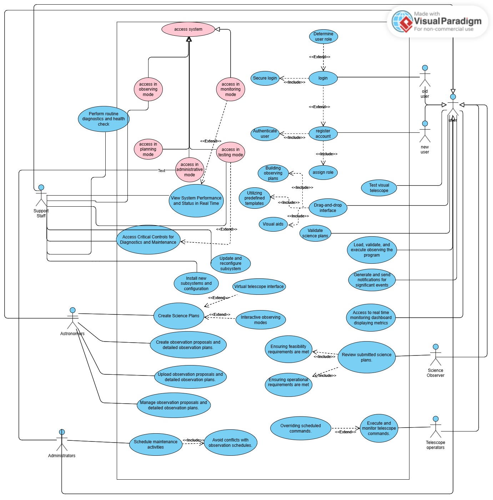

All users
- Login: this use case shows how old user log in to their existing account
- Register account: this use case shows how the account is registered by the new user
- Users can create observing plans using a drag-and-drop interface with templates and visual aids, simulate telescope operations to test plans, and monitor real-time progress through a dashboard displaying weather, telescope position, and observation status. 
Astronomer
- Astronomers have access to planning mode to create science plans.
- Astronomers have access in observation mode to create, upload ,and manage observation proposals and detailed observation plans.
Science Observer
- Science Observers have access to observation mode to review submitted science plans.
Telescopic Operator
- Science Observers have access to all modes including observation, monitoring, operation, planning to execute and monitor telescope commands.
Support Staff
- Monitor System Performance and Status: Support Staff have access to real-time system performance data, enabling them to identify and address potential issues proactively before they affect operations.
- Access Critical Controls for Diagnostics and Maintenance: Support Staff can access essential system controls to verify and assess system functionality during diagnostics or maintenance procedures, ensuring smooth and uninterrupted operations.
- Utilize Test-Level Access for Troubleshooting: With test-level access, Support Staff can troubleshoot and validate subsystems to resolve any issues, ensuring that everything operates as expected.
- Perform Routine Diagnostics and Health Checks: They regularly perform diagnostics and health checks on hardware and software subsystems to detect and resolve potential issues early on.
- Install New Subsystems and Configurations: Support Staff can install new subsystems or update existing ones within the system, using an intuitive interface designed to manage the installation processes seamlessly.
- Update and Reconfigure Subsystems: They can make updates or reconfigurations to subsystems without causing disruptions to the system’s operational schedules, ensuring minimal impact on ongoing activities.
Developer 
- Developers can access Maintenance and Test levels with Monitoring and Testing mode permissions.
- Developers design, test, configure, and upgrade system components without disrupting operations.
- Developers use test environments for software integration and validation.
- Developers install and deploy new software versions.
- Developers intervene remotely or onsite to resolve major software issues.
- Developers can securely access the system from onsite, remote facilities, or partner institutions.
Administrator
- Administrators could plan and schedule system maintenance without disrupting active observations.
