<table>
<colgroup>
<col style="width: 34%" />
<col style="width: 23%" />
<col style="width: 41%" />
</colgroup>
<tbody>
<tr class="odd">
<td>Use Case Name: Install new subsystems and configuration</td>
<td>ID: 01</td>
<td>Importance Level: High</td>
</tr>
<tr class="even">
<td colspan="2">Primary Actor: Support Staff</td>
<td>Use Case Type: User Initiated</td>
</tr>
<tr class="odd">
<td colspan="3">
Stakeholders and Interests:

<strong>Support Staff</strong>: Responsible for installing new
subsystems and ensuring that they integrate correctly with the existing
infrastructure. They need a smooth, error-free process to maintain
operational stability.

<strong>Telescope Operator</strong>: Relies on properly configured
subsystems to ensure accurate telescope control and observational
operations.

<strong>Astronomer</strong>: Needs the installed subsystems to
function correctly to support scientific observations and data
collection.

<strong>Science Observer</strong>: Uses the telescope and its
subsystems indirectly and depends on their correct configuration for
seamless operation.

<strong>Administrators</strong>: Oversee system integrity and may
need to approve or review installations for compliance with observatory
standards.
</td>
</tr>
<tr class="even">
<td colspan="3">
Brief Description:

The use case describes the process for installing new subsystems and
configuring them for use in operations. The support staff will initiate
the installation process after validating the configuration files. The
system then makes updates, applies the configuration, and performs
diagnostics. Errors are rolled back with a log issue for
troubleshooting. When the successful installation process has been
verified, the system updates its logs, and support staff confirm that
the subsystem is ready.
</td>
</tr>
<tr class="odd">
<td colspan="3">
Trigger: The support staff initiates the installation
process for new subsystems.

Type: User-Initiated
</td>
</tr>
<tr class="even">
<td colspan="3">
Relationships:

Association: Support Staff

Include: File Validation, Installation Execution

Extend: Error handling, Rollback Process
</td>
</tr>
<tr class="odd">
<td colspan="3">
Normal Flow of Events:

<ol type="1">
<li>
The support staff logs into the system.
</li>
<li>
The support staff navigates to the "Subsystem Installation"
section.
</li>
<li>
The system displays available installation options.
</li>
<li>
The support staff selects a subsystem and uploads configuration
files.
</li>
<li>
The system validates the uploaded files.

<ul>
<li>
If files are invalid, an error message is displayed, and staff
re-uploads files.
</li>
</ul></li>
<li>
If valid, the system proceeds with the installation.
</li>
<li>
The system updates and reconfigures the necessary
components.
</li>
<li>
The system confirms successful installation and updates the
logs.
</li>
<li>
The support staff verifies system status and logs out.
</li>
</ol></td>
</tr>
<tr class="even">
<td colspan="3">
Subflows:

<ul>
<li>
<strong>1a:</strong> Support staff checks system logs for prior
installation history.
</li>
<li>
<strong>2a:</strong> Support staff saves a report of the
installation process for future reference.
</li>
</ul></td>
</tr>
<tr class="odd">
<td colspan="3">
Alternate/Exceptional Flow:

<ul>
<li>
<strong>AE1:</strong> If the system fails to authenticate the
user, access is denied.
</li>
<li>
<strong>AE2:</strong> If an invalid configuration file is
uploaded, the system prompts for re-upload.
</li>
<li>
<strong>AE3:</strong> If the installation fails, the system rolls
back changes and logs an error.
</li>
</ul></td>
</tr>
</tbody>
</table>

## 

## **Activity Diagram**

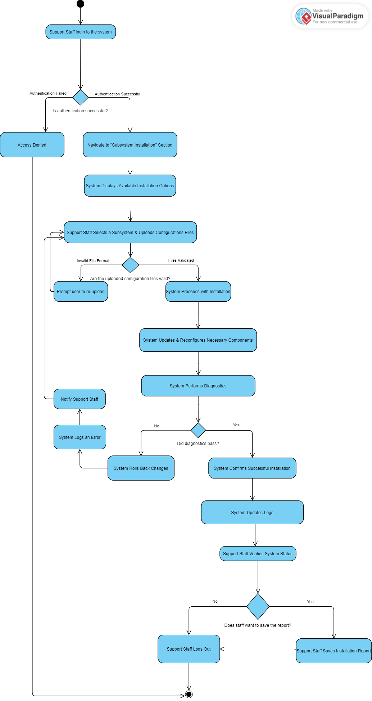

## **Sequence Diagram**

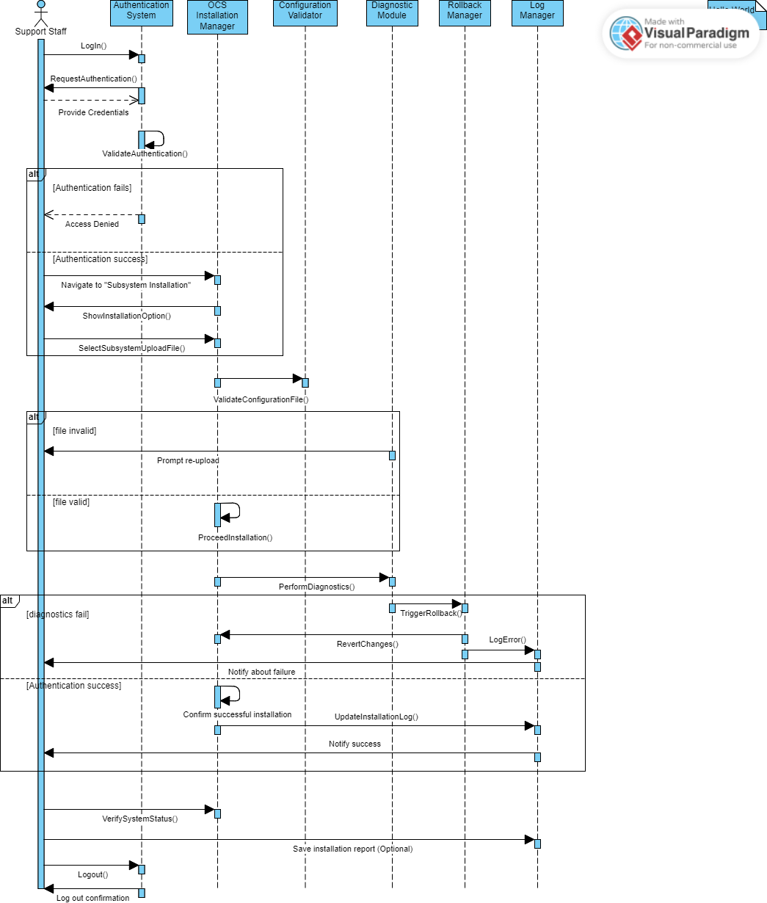

## 

<table>
<colgroup>
<col style="width: 45%" />
<col style="width: 20%" />
<col style="width: 33%" />
</colgroup>
<tbody>
<tr class="odd">
<td>Use Case Name: Create an observing plan</td>
<td>ID: 02</td>
<td>Important Level: High</td>
</tr>
<tr class="even">
<td>Primary Actor: Science Observer</td>
<td colspan="2">Use Case Type: Essential</td>
</tr>
<tr class="odd">
<td colspan="3">
Stakeholders and Interests:

<ol type="1">
<li>
<strong>Astronomer</strong>: Proposes and defines the science
plan.
</li>
<li>
<strong>Science Observer</strong>: Validates and transforms the
science plan into an executable observing program.
</li>
<li>
<strong>Telescope: Operator:</strong> Ensures that the telescope
is properly configured and operational.
</li>
<li>
<strong>Observatory Operations Staff</strong>: Manages overall
scheduling and telescope availability.
</li>
<li>
<strong>System Administrators / IT Support</strong>: Maintains
the Observatory Control System (OCS) software and hardware.
</li>
<li>
<strong>Observatory Management &amp; Scheduling
Committee</strong>: Oversees the allocation of telescope time and
ensures alignment with observatory goals.
</li>
</ol></td>
</tr>
<tr class="even">
<td colspan="3">Brief Description: The use case demonstrates the process
of creating an observing program by defining observation sequences,
configuring telescope and instrument settings, integrating with the
scheduling system, preparing for automated execution and
validation.</td>
</tr>
<tr class="odd">
<td colspan="3">
Trigger: The science observer initiated the process
of creating an observing plan.

Type: User Initiated
</td>
</tr>
<tr class="even">
<td colspan="3">
Relationships:

Association: Science Observer

Include: Validate Observation Sequences -&gt; verify observation
feasibility, validate telescope and instrument Parameters -&gt; check
Telescope &amp; instrument readiness, final Review &amp; validation
-&gt; perform final observing program validation

Extent: validate observation sequences &lt;-&gt; revise observation
Sequences, validate telescope and instrument parameters &lt;-&gt; adjust
telescope &amp; instrument settings, integrate with scheduling system
&lt;-&gt; reschedule observation program, final review &amp; validation
&lt;-&gt; request additional review

Generalization: manage observing plans -&gt; create an observing
program, validate observing parameters -&gt; validate observation
sequences, validate observing parameters -&gt; validate telescope and
instrument parameters
</td>
</tr>
<tr class="odd">
<td colspan="3">
Normal Flow of Events:

<ol type="1">
<li>
The science observer receive the validated science plan
</li>
<li>
The science observer define observation sequences
</li>
<li>
The science observer validate observation sequences
</li>
<li>
The science observer set up telescope and instrument
parameters
</li>
<li>
The science observer validate telescope and instrument
parameters
</li>
<li>
The science observer integrate with scheduling system
</li>
<li>
The science observer prepare for automated execution
</li>
<li>
The science observer does the final review and
validation
</li>
<li>
The science observer submit the observing program
</li>
</ol></td>
</tr>
<tr class="even">
<td colspan="3">
SubFlows:

1a: Verify completeness and correctness.

2a: Assign telescope pointing, exposure times, and calibration
steps.

3a: Check feasibility against telescope and environmental
constraints.

4a: Configure tracking, guiding, filters, and detector settings.

5a: Ensure all configurations meet requirements.

6a: Assign priority and allocate observation slots.

7a: Format for observatory control system, run simulations if
needed.

8a: Confirm program readiness and compliance.

9a: Send to the system for execution.
</td>
</tr>
<tr class="odd">
<td colspan="3">
Alternate/Exception Flows:

1b: If the validated science plan has issues, determine whether they
are minor or major.

<ul>
<li>
1c: If the issues are minor

<ul>
<li>
Request changes from the astronomer.
</li>
<li>
The astronomer resubmits the plan, and the process
restarts.
</li>
</ul></li>
<li>
1d: If the issues are major, reject the plan.
</li>
</ul>

3b: If issues are found in the observation sequences, check if they
can be fixed.

<ul>
<li>
3c: If feasible, modify the observation sequences and revalidate
them.
</li>
<li>
3d: If not feasible, the process stops.
</li>
</ul>

5b: If the selected instrument is unavailable, an alternate
instrument is selected.

5c: If the telescope is malfunctioning, determine if it can be
rescheduled.

<ul>
<li>
5d: If rescheduling is possible, wait for the telescope to
function and retry.
</li>
<li>
5e: If rescheduling is not possible, the process stops.
</li>
</ul>

6b: If there is a scheduling conflict during integration with the
scheduling system, adjust and reschedule.

7b: If errors occur while preparing for automated execution, optimize
settings and fix errors.

8b: If issues are found in the final review, fix them before
submitting.
</td>
</tr>
</tbody>
</table>

## 

## **Activity Diagram**

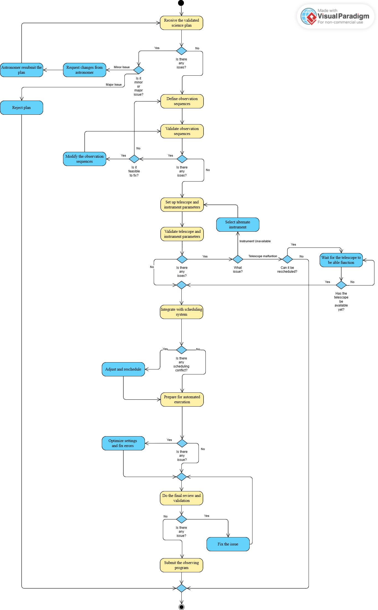

## **Sequence Diagram**

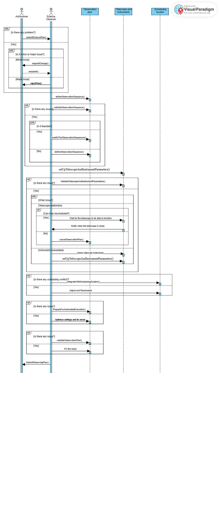

<table>
<colgroup>
<col style="width: 34%" />
<col style="width: 23%" />
<col style="width: 41%" />
</colgroup>
<tbody>
<tr class="odd">
<td>Use Case Name: Control the Telescope via Command Line</td>
<td>ID: 03</td>
<td>Importance Level: High</td>
</tr>
<tr class="even">
<td colspan="2">Primary Actor: Telescope Operator</td>
<td>Use Case Type: User Initiated</td>
</tr>
<tr class="odd">
<td colspan="3">
Stakeholders and Interests:

<strong>Telescope Operator:</strong> Needs to control the telescope
for observational and operational purposes using the command line
interface.

<strong>Astronomer:</strong> Requires telescope control for executing
a science plan and gathering data.

<strong>Science Observer:</strong> May rely on command-line control
for indirect telescope operations.
</td>
</tr>
<tr class="even">
<td colspan="3">
Brief Description:

This use case describes how a telescope operator controls the
telescope using the command line to modify the location of the
telescope, set up observational parameters, and check that everything is
correctly implemented for making the astronomical observations.
</td>
</tr>
<tr class="odd">
<td colspan="3">
Trigger: The telescope operator initiates a
command-line session to control the telescope.

Type: User-Initiated
</td>
</tr>
<tr class="even">
<td colspan="3">
Relationships:

Association: Telescope Operator

Include:

Extend:

Generalization:
</td>
</tr>
<tr class="odd">
<td colspan="3">
Normal Flow of Events:

1. The telescope operator logs into the system.

2. The operator opens the command-line interface for telescope
control.

3. The system authenticates the user and provides access to control
commands.

4. The operator inputs commands to adjust the telescope's position
and configure settings.

5. The system executes the commands and provides real-time
feedback.

6. The telescope responds accordingly, adjusting to the specified
parameters.

7. The operator verifies the telescope’s response and makes any
necessary adjustments.

8. The operator completes the session and logs out of the
system.
</td>
</tr>
<tr class="even">
<td colspan="3">
Sub flows:

4a: Operator requests the status of the telescope before making
adjustments.

7a: Operator saves the command logs for future reference.
</td>
</tr>
<tr class="odd">
<td colspan="3">
Alternate/Exceptional Flow:

1b: If the system fails to authenticate the user, access is
denied.

2b: If an invalid command is entered, the system provides an error
message and suggests correct syntax.

4b: If the telescope fails to respond, the operator is notified of a
possible hardware or software issue.
</td>
</tr>
</tbody>
</table>

##

## **Activity Diagram**

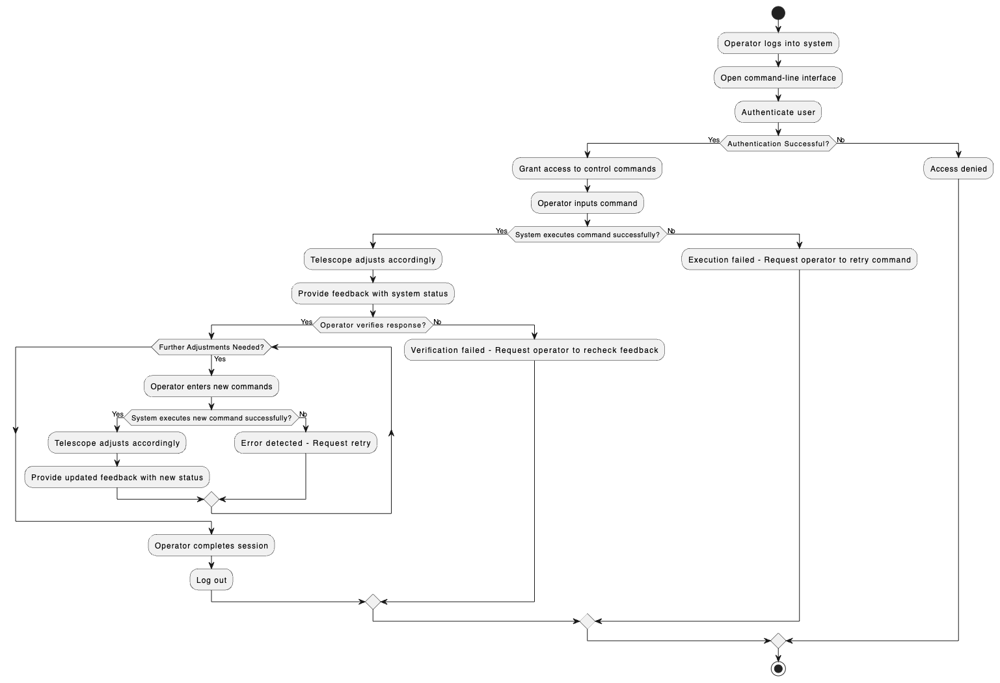

## **Sequence Diagram**

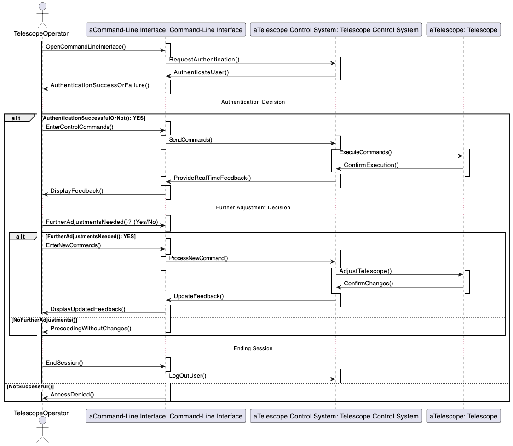

<table>
<colgroup>
<col style="width: 33%" />
<col style="width: 33%" />
<col style="width: 33%" />
</colgroup>
<tbody>
<tr class="odd">
<td>Use Case Name: Control High-level Functions</td>
<td>ID: 04</td>
<td>Importance Level: High</td>
</tr>
<tr class="even">
<td colspan="2">Primary Actor: Administrator</td>
<td>Use Case Type: Essential</td>
</tr>
<tr class="odd">
<td colspan="3">
Stakeholders and Interests:

<strong>Administrator:</strong> responsible to control and manage
high-level functions and systems

<strong>Every users:</strong> need the roll granted by the high-level
functions to operate the systems
</td>
</tr>
<tr class="even">
<td colspan="3">
Brief Description:

This case allows Administrators to control high-level functions,
including defining user access modes, managing users, and defining
operation levels.
</td>
</tr>
<tr class="odd">
<td colspan="3">
Trigger:

Type: User-Initiated
</td>
</tr>
<tr class="even">
<td colspan="3">
Relationships:

Association: Administrator, Every users

Include:

Extend:Define user’s access mode, User Management, Define operation
level

Generalization:
</td>
</tr>
<tr class="odd">
<td colspan="3">
Normal Flow of Events:

<ol type="1">
<li>
Administrator logs into the system.
</li>
<li>
Administrator opens up the high-level feature control
panel.
</li>
<li>
Administrator selects the feature to operate/ control.
</li>
<li>
Administrator saves the configurations.
</li>
</ol></td>
</tr>
<tr class="even">
<td colspan="3">
Sub flows:

3a: Define User Access Modes:

<ul>
<li>
1a: Administrator selects "User Access Modes" from the control
panel.
</li>
<li>
2a: The system displays a list of current user access
modes.
</li>
<li>
3a: Administrator modifies the access modes as needed.
</li>
<li>
4a: Administrator confirms the changes.
</li>
</ul>

3b: Manage Users:

<ul>
<li>
1b: Administrator selects "Manage Users" from the control
panel.
</li>
<li>
2b: The system displays a list of current users.
</li>
<li>
3b: Administrator adds, removes, or updates user
information.
</li>
<li>
4b: Administrator confirms the changes.
</li>
</ul>

3c: Define Operational Levels:

<ul>
<li>
1c: Administrator selects "Operational Levels" from the control
panel.
</li>
<li>
2c: The system displays the current operational levels.
</li>
<li>
3c: Administrator modifies the operational levels as
needed
</li>
<li>
4c: Administrator confirms the changes.
</li>
</ul></td>
</tr>
<tr class="odd">
<td colspan="3">
Alternate/Exceptional Flow:

AE1: If the system fails to authenticate the user, access is
denied.

AE2: If non-administrator attempt to access these features, the
system will deny the access.

AE3: If an administrator provides invalid form of inputs while
managing high-level features, the system will display error access and
deny the input.

AE4: if the system failed to save the configuration the system rolls
back the changes and shows the error logs.
</td>
</tr>
</tbody>
</table>

## 

## **Activity Diagram**

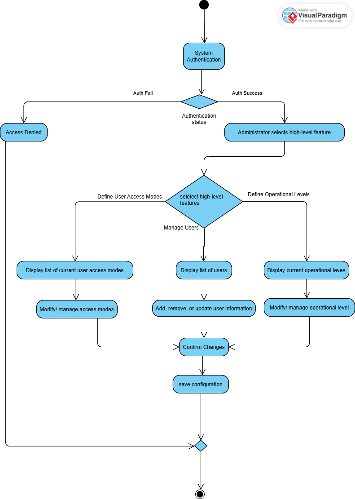

## **Sequence Diagram**

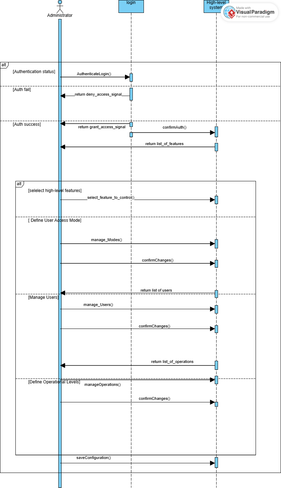

<table>
<colgroup>
<col style="width: 50%" />
<col style="width: 12%" />
<col style="width: 12%" />
<col style="width: 25%" />
</colgroup>
<tbody>
<tr class="odd">
<td>Use Case Name: Create a science plan</td>
<td colspan="2">ID: 05</td>
<td>Importance Level: High</td>
</tr>
<tr class="even">
<td colspan="2">Primary Actor: Astronomer</td>
<td colspan="2">Use Case Type: Essential</td>
</tr>
<tr class="odd">
<td colspan="4">
Stakeholders and Interests:

<strong>Primary Actor:</strong>

Astronomer wants to create, test, and submit a science plan
efficiently.

<strong>Secondary Actors:</strong>

Science Observe ensures the science plan is valid and executable.

Telescope Operator ensures the telescope and instruments are used
correctly.

Administrator oversees scheduling and system operations.

Support &amp; Developer Team maintaining system functionality and
fixing issues.
</td>
</tr>
<tr class="even">
<td colspan="4">Brief Description: This use case describes how to create
a science plan.</td>
</tr>
<tr class="odd">
<td colspan="4">
Trigger:

<ol type="1">
<li>
A science plan submission might trigger a validation
process.
</li>
<li>
A weather change could trigger a rescheduling of the
observation.
</li>
<li>
A telescope error might trigger a diagnostic sequence.
</li>
</ol>

Type: Internal
</td>
</tr>
<tr class="even">
<td colspan="4">
Relationships:

<blockquote>

Association: astronomer, science observer, operation staff

Include: create science plan -&gt; simulate science plan, validate
science plan -&gt; check instrument configuration

Extend: create science plan &lt;-&gt; modify science plan, validate
observing program &lt;-&gt; adjust program for scheduling conflicts.

Generalization: execute observing program -&gt; execute program with
adjustments

</blockquote></td>
</tr>
<tr class="odd">
<td colspan="4">
Normal Flow Events:

<ol type="1">
<li>
The astronomer creates a science plan.
</li>
<li>
The astronomer submits the science plan.
</li>
<li>
Science Observer validates the science plan.
</li>
<li>
Operation staff transform the science plan into an observing
program.
</li>
<li>
Operation staff validate the observing program.
</li>
<li>
Science observer executes the observing program.
</li>
<li>
The astronomer collects and validates data.
</li>
</ol></td>
</tr>
<tr class="even">
<td colspan="4">
Subflows:

1a. Use the virtual telescope to test feasibility.

2a. System checks for completeness.

3a: Observer checks instrument and schedule feasibility.

4a: Ensure compatibility with the observing queue.

5a: Validate telescope operation and safety.

6a: Monitor progress and adjust as needed.

7a: Ensure image quality and completeness.
</td>
</tr>
<tr class="odd">
<td colspan="4">
Alternate/Exceptional Flow:

1b: Modify the plan if the simulation fails.

2b: Plan is rejected if details are missing.

3b: If conflicts exist, request plan revision.

4b: Adjust the program if scheduling conflicts arise.

5b: Reject the program if it risks system stability.

6b: Reschedule if interrupted by technical issues.

7b: If data is corrupt, schedule re-observation.
</td>
</tr>
</tbody>
</table>

## **Activity Diagram**

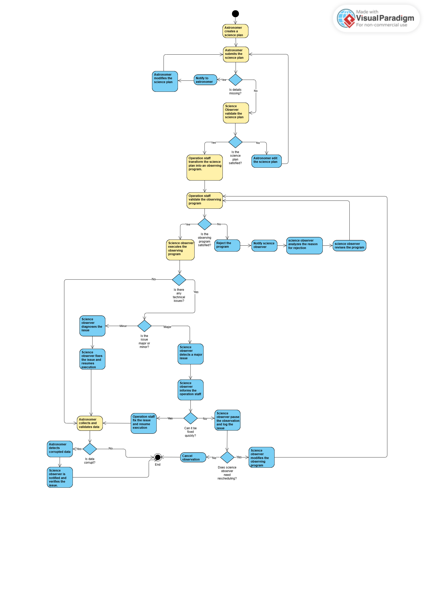

## **Sequence Diagram**

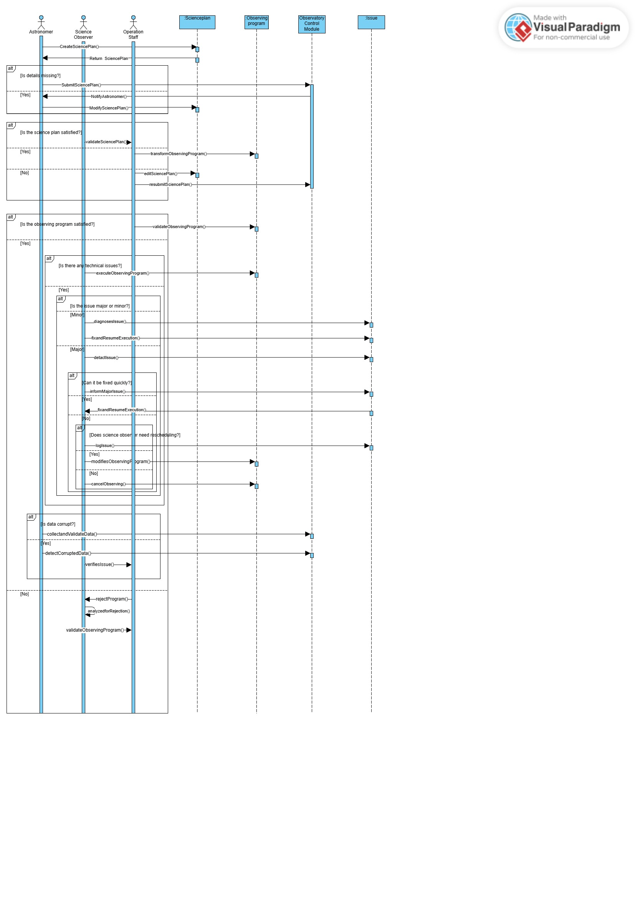

## **Class Diagram**
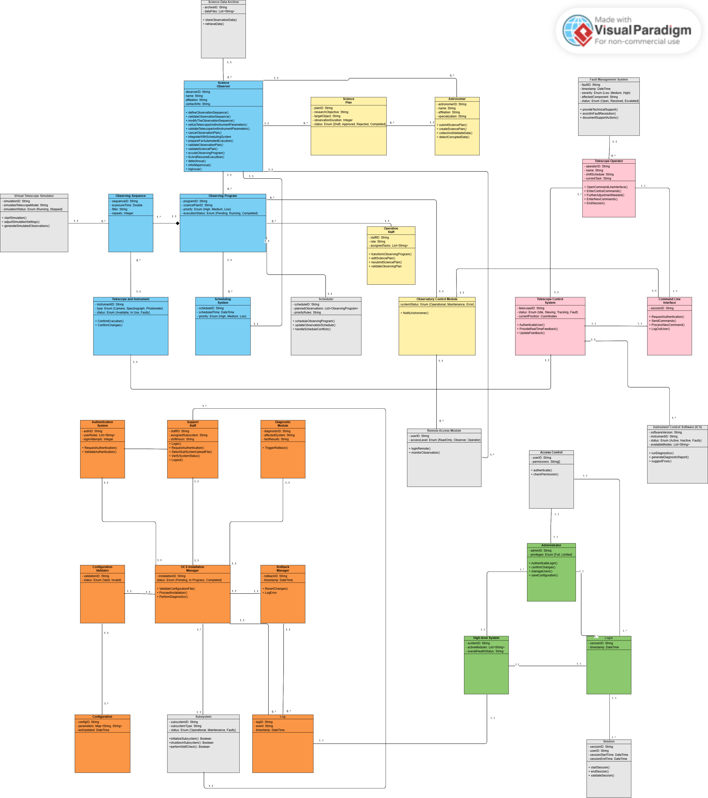
