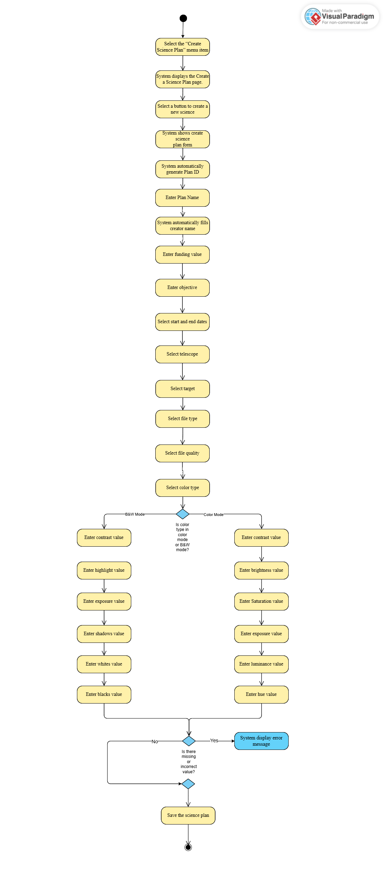
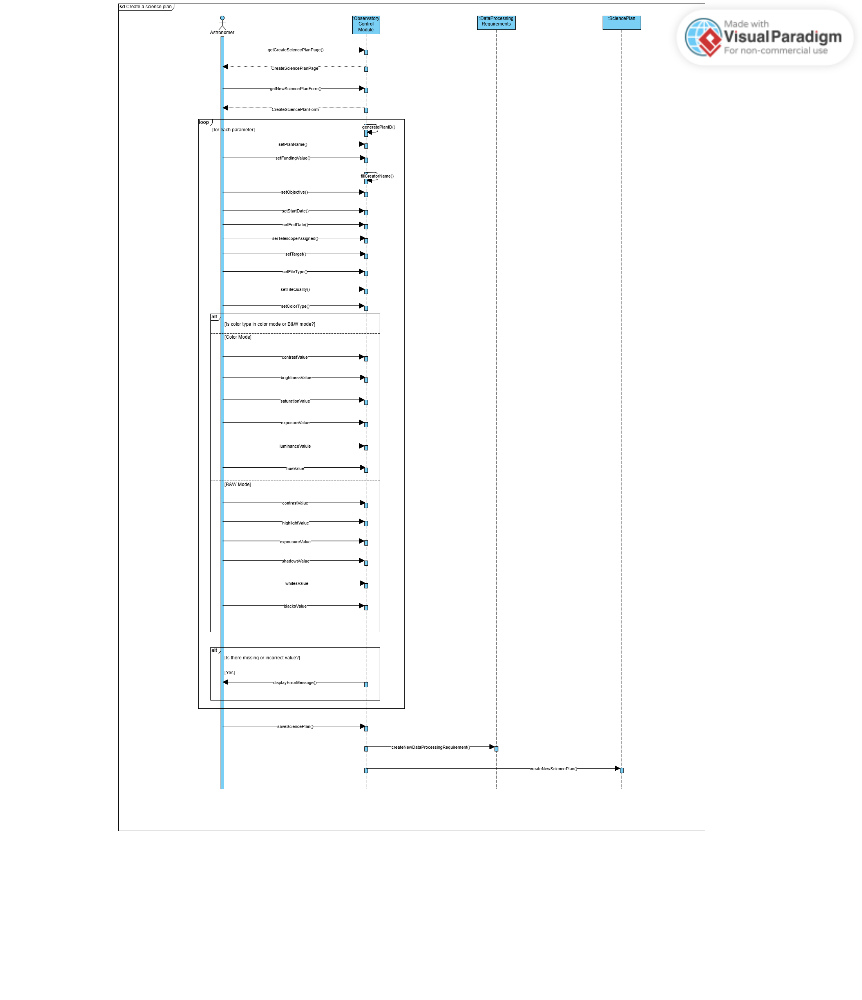
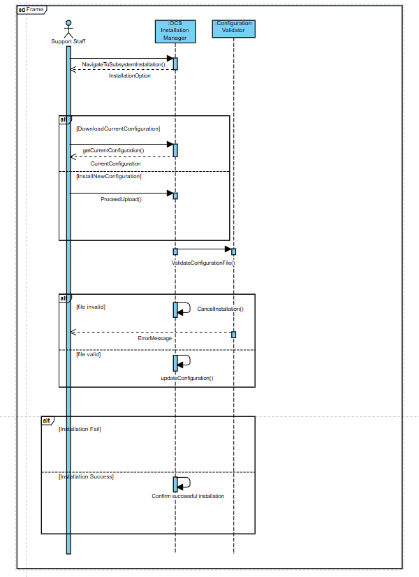
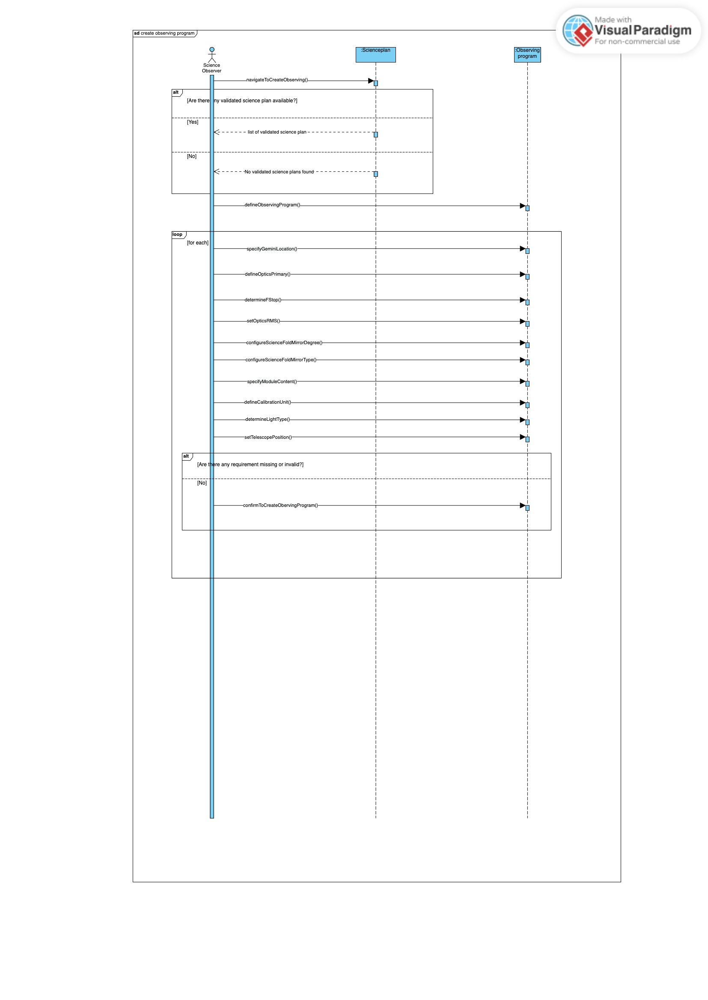

<table>
<colgroup>
<col style="width: 34%" />
<col style="width: 23%" />
<col style="width: 41%" />
</colgroup>
<tbody>
<tr>
<td>Use Case Name: Create a science plan</td>
<td>ID: 01</td>
<td>Importance Level: High</td>
</tr>
<tr>
<td colspan="2">Primary Actor: Astronomer</td>
<td>Use Case Type: Essential</td>
</tr>
<tr>
<td colspan="3">
<strong>Stakeholders and Interests:</strong>

<strong>Primary Actor:</strong> Astronomers want to create a science plan

</td>
</tr>
<tr>
<td colspan="3">
<strong>Brief Description:</strong>

This use case describes how to create a science plan.

</td>
</tr>
<tr>
<td colspan="3">
<strong>Trigger:</strong> The science observer initiated the process of creating an observing plan.

<strong>Type:</strong> User-Initiated

</td>
</tr>
<tr>
<td colspan="3">
<strong>Relationships:</strong>

<strong>Association:</strong> Astronomers

Include: -

Extent: -

Generalization: -

</td>
</tr>
<tr>
<td colspan="3">
<strong>Normal Flow Events:</strong>

<ol>
<li>The astronomer selects the “Create Science Plan” menu item.</li>
<li>The system displays the Create a Science Plan page.</li>
<li>The astronomer selects a button to create a new science plan.</li>
<li>The System shows the create science plan form</li>
<li>The astronomer fills in all the details. </li>
<li>The astronomer selects the Data processing requirements. </li>
<li>The astronomer creates the science plan by clicking the “Save Science Plan” button.</li>
</ol>
</td>
</tr>
<tr>
<td colspan="3">
<strong>Subflows:</strong>

<ul>
<li>5a. Plan ID – automatically generated</li>
<li>5b. Plan Name – short plain text</li>
<li>5c. Creator – automatically filled using the astronomer's account information</li>
<li>5d. Funding – numerical values in Dollars with decimal points</li>
<li>5e. Objective – long plain text</li>
<li>5f. Start and End dates – select from a calendar</li>
<li>5g. Telescope assigned – a list of two telescopes: Hawaii and Chile</li>
<li>5h. Target – based on the star system selected from a list of star catalogue</li> 
<li>6a. FileType – PNG, JPEG, RAW</li>
<li>6b. FileQuality – Low, Fine</li>
<li>6c. ColorType – Color mode, B&W mode</li>
<li>6d. Contrast – decimal values (for both color and B&W modes)</li>
<li>6e. Brightness – decimal values (only for color mode)</li>
<li>6f. Saturation – decimal values (only for color mode)</li>
<li>6g. Highlights – decimal values (only for B&W mode)</li>
<li>6h. Exposure – decimal values (for both color and B&W modes)</li>
<li>6i. Shadows – decimal values (only for B&W mode)</li>
<li>6j. Whites – decimal values (only for B&W mode)</li>
<li>6k. Blacks – decimal values (only for B&W mode)</li>
<li>6l. Luminance – decimal values (only for color mode)</li>
<li>6m. Hue – decimal values (only for color mode)</li>
</ul>
</td>
</tr>
<tr>
<td colspan="3">
<strong>Alternate/Exceptional Flow:</strong>

<ul>
<li>6a. If any required field is missing or incorrect, the system displays an error message and the astronomer select the data processing requirement again.</li>
<li>6b: If the selected Schedule has a start date after an end date, the system alerts 
with a “Start date cannot be after the end date”. </li>
<li>If the input data is not compatible with the legacy OCS system (e.g., invalid file format, unsupported field values, or missing required information), the system displays an error message: “Input data is not compatible with the legacy OCS system.</li>
</ul>
</td>
</tr>
</tbody>
</table>

## 

## **Activity Diagram**

## **Sequence Diagram**

## 
<table>
<colgroup>
<col style="width: 34%" />
<col style="width: 23%" />
<col style="width: 41%" />
</colgroup>
<tbody>
<tr class="odd">
<td>Use Case Name: Install New Configurations and Subsystems</td>
<td>ID: 02</td>
<td>Importance Level: High</td>
</tr>
<tr class="even">
<td colspan="2">Primary Actor: Support Staff</td>
<td>Use Case Type: User Initiated</td>
</tr>
<tr class="odd">
<td colspan="3">
Stakeholders and Interests:

<strong>Support Staff</strong>: Requires straightforward installation process with clear status updates.

<strong>Telescope Operator</strong>: Needs assurance that configuration changes won't disrupt ongoing operations.

<strong>System Administrators</strong>: Need complete records of all configuration changes.
</td>
</tr>
<tr class="even">
<td colspan="3">
Brief Description:

This use case covers the installation of new subsystem configurations through a streamlined process. Support staff can upload and apply new configurations while maintaining the ability to revert changes if needed.
</td>
</tr>
<tr class="odd">
<td colspan="3">
Trigger: Support staff initiates new configuration installation process.

Type: User-Initiated
</td>
</tr>
<tr class="even">
<td colspan="3">
Relationships:

Association: Support Staff

Include: Configuration Validation

Extend: Rollback Process
</td>
</tr>
<tr class="odd">
<td colspan="3">
Normal Flow of Events:

<ol type="1">
<li>
Support staff navigates to "Subsystem Configuration" section.
</li>
<li>
System displays current configuration with options to download or install new configuration.
</li>
<li>
Support staff selects "Install New Configuration" option.
</li>
<li>
System presents upload interface for new configuration files.
</li>
<li>
System performs basic validation checks:
<ul>
<li>File structure integrity</li>
<li>Required fields presence</li>
</ul>
</li>
<li>
System applies new configuration.
</li>
<li>
System displays installation completion status.
</li>
</ol></td>
</tr>
<tr class="even">
<td colspan="3">
Subflows:

<ul>
<li>
<strong>SF1:</strong> System creates backup of previous configuration.
</li>
<li>
<strong>SF2:</strong> Support staff can download current configuration before changes.
</li>
</ul></td>
</tr>
<tr class="odd">
<td colspan="3">
Alternate/Exceptional Flow:

<ul>
<li>
<strong>AE1:</strong> Invalid configuration file - System rejects upload and specifies errors.
</li>
<li>
<strong>AE2:</strong> Installation failure - System automatically reverts to previous configuration and notify the user.
</li>
</ul></td>
</tr>
</tbody>
</table>

## 

## **Activity Diagram**

## **Sequence Diagram**

## 

<table>
<colgroup>
<col style="width: 34%" />
<col style="width: 23%" />
<col style="width: 41%" />
</colgroup>
<tbody>
<tr class="odd">
<td>Use Case Name: Create an observing program</td>
<td>ID: 03</td>
<td>Importance Level: High</td>
</tr>
<tr class="even">
<td colspan="2">Primary Actor: Science Observer</td>
<td>Use Case Type: Essential</td>
</tr>
<tr class="odd">
<td colspan="3">
Stakeholders and Interests:

<strong>Science Observer</strong>: wants to create an observing program by transforming a validated science plan.

</td>
</tr>
<tr class="even">
<td colspan="3">
Brief Description:

This use case describes the process by which a science observer converts a validated science plan into an observing program. The observing program includes essential parameters such as Gemini location, optics configuration, calibration details, and telescope positioning data to ensure accurate execution.

</td>
</tr>
<tr class="odd">
<td colspan="3">
Trigger: After validating a science plan, the science observer initiates the transformation of the science plan into an observing program.

Type: User-Initiated
</td>
</tr>
<tr class="even">
<td colspan="3">
Relationships:

Association: Science Observer

Include: -

Extend: -

Generalization: -
</td>
</tr>
<tr class="odd">
<td colspan="3">
Normal Flow of Events:

<ol type="1">
<li>
The science observer navigates to the "Create an Observing Program" page. 

</li>
<li>
The system presents a list of validated science plans.

</li>
<li>
The science observer selects a validated science plan to create an observing program.

</li>
<li>
The system loads the selected science plan, allowing the science observer to define the observing program.
</li>
<li>
The science observer enters required details for the observing program.

<li>
The science observer finalizes the observing program by clicking the "Create Observing Program" button.

<li>
The system updates the validation status of the observing program.

<li>
The system confirms the creation of the observing program and updates the system records.

<ul>
</ol></td>
</tr>
<tr class="even">
<td colspan="3">
Subflows:

<ul>
<li>
5a: Gemini Location – Specifies the location where the observation will take place.

</li>
<li>
5b: Optics Primary – Defines the primary optics settings.
</li>
<li>
5c:  F-stop – Determines the aperture settings for the telescope.

</li>
<li>
5d: Optics Secondary RMS – Sets the secondary optics root mean square (RMS) values. 

</li>
<li>
5e: Science Fold Mirror Degree – Configures the angle of the fold mirror. 

</li>
<li>
5f: Science Fold Mirror Type – Selects the appropriate type of fold mirror. 

</li>
<li>
5g: Module Content – Specifies the module data required for observation.  

</li>
<li>
5h:  Calibration Unit – Defines the calibration settings for accuracy. 

</li>
<li>
5i: Light Type – Determines the type of light source used during observation.  

</li>
<li>
5j: Telescope Position Pair – Sets the positional coordinates for telescope alignment. 

</li>
</ul></td>
</tr>
<tr class="odd">
<td colspan="3">
Alternate/Exceptional Flow:

<ul>
<li>
AE1: If there are no validated science plans available, the system displays "No validated science plans found." 
</li>
<li>
AE2: If required details are missing or invalid, the system prompts the science observer to enter the necessary information before proceeding.

</li>
<li>
AE3: If the system encounters an error during the creation process, it displays an appropriate error message and logs the issue.

</li>
</ul></td>
</tr>
</tbody>
</table>

## 

## **Activity Diagram**

## **Sequence Diagram**

## 
## **Class Diagram**

